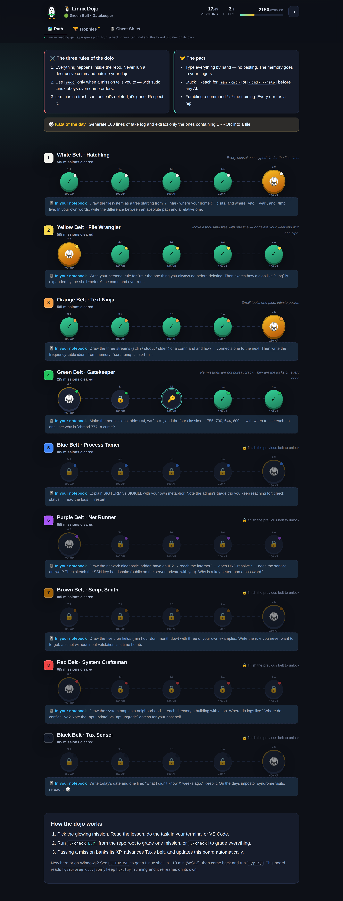
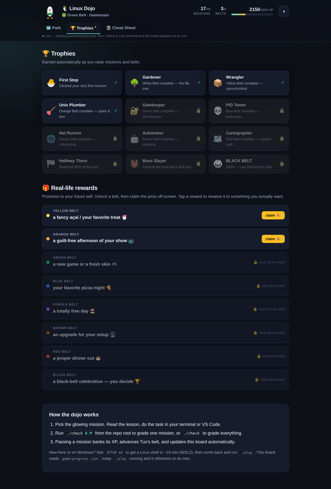
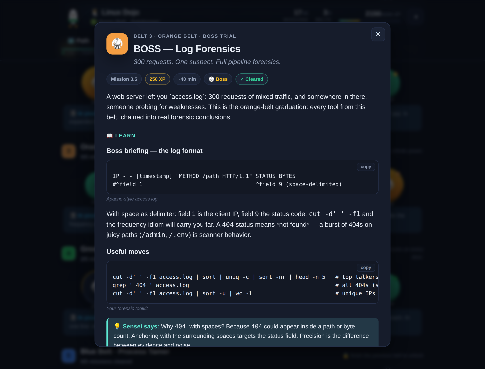

<div align="center">

# 🐧🥋 Linux Dojo

### Go from your first `pwd` to black-belt operator — one hands-on mission at a time.

A gamified, self-contained course that lives **inside this repository**. Nine belts, forty-five
missions, one penguin who levels up as you do. You learn by *doing* real commands in your terminal;
a built-in grader checks your work and a Duolingo-style board tracks every belt you earn.

</div>

<p align="center">
  
</p>

---

## Why this exists

Most "learn Linux" resources are videos you watch or pages you read. You forget them by Tuesday.
The Dojo is the opposite: **every mission is a task you perform on a real filesystem**, and you don't
advance until a script confirms you actually did it. The knowledge sticks because your hands did the work.

- 🎯 **45 missions across 9 belts** — from `ls` and `cd` to signals, permissions, networking, shell scripting, cron, deployments, and incident response.
- 🧪 **A real grader** — `./check` inspects the files and scripts you produced and tells you, requirement by requirement, what passes and what to fix.
- 🎮 **A game board that makes you want to continue** — Tux changes belts, an XP bar fills, bosses guard each belt, and the board updates live as you pass missions.
- 📦 **100% self-contained & offline** — no accounts, no servers, no dependencies to install. Just Bash, and Python only if you want the pretty board. Works on macOS and Linux.

---

## The three rules of the dojo

1. **Everything happens inside the repo.** Never run a destructive command outside your dojo.
2. **Use `sudo` only when a mission tells you to** — with sudo, Linux obeys even dumb orders.
3. **`rm` has no trash can:** once it's deleted, it's gone. Respect it.

## The pact

- **Type everything by hand — no pasting.** The memory goes to your fingers.
- **Stuck? Reach for `man <cmd>` or `<cmd> --help` _before_ any AI.**
- **Fumbling a command _is_ the training.** Every error is a rep.

> That's why every mission hides its solution behind a "reveal hints" fold — the answer exists, but it
> costs one conscious click. These rules live on the game board's home screen too.

## Quickstart (60 seconds)

> **On Windows, or a fresh machine?** Do [`SETUP.md`](SETUP.md) first — it gets you a real Linux shell
> via WSL2 in about 10 minutes. Then come back here.

```bash
# 1) Open the game board (serves it locally and opens your browser)
./play

# 2) In the board, click the glowing mission. Read the lesson. Do the task
#    in your terminal or in VS Code — right here in this repo.

# 3) Grade your work from the repo root:
./check 1.1        # check one mission
./check            # check everything and see the full dojo board in your terminal
```

That's it. Pass `1.1`, watch Tux earn XP, and keep climbing. When all 45 missions are green,
the repository — and you — are complete.

> **No Python?** No problem. Open `game/index.html` directly in your browser; the board reads your
> saved progress from `game/progress.js`. You still grade with `./check`. Python only powers the
> optional live-refreshing local server.

---

## How it works

```
   you read a mission            you do the task              ./check grades it
   ┌───────────────┐            ┌───────────────┐            ┌──────────────────┐
   │ game board or │  ───────▶  │ your terminal │  ───────▶  │ inspects the     │
   │ mission README│            │ / VS Code     │            │ files you made   │
   └───────────────┘            └───────────────┘            └────────┬─────────┘
            ▲                                                          │
            │                 progress.json / progress.js             │
            └──────────────  board updates, Tux earns a belt  ◀────────┘
```

Every mission is a folder under [`missions/`](missions/) containing a `README.md` (the lesson + the
task) and any practice files you'll work on. You never need to leave the repo. The grader is
**artifact-based** — it reads the files and runs the scripts you created, so it behaves identically
on any machine and never depends on your operating system's internals.

---

## More than a checklist

The board (`./play`) is a small game in three tabs:

- **🗺️ Path** — the serpentine belt map. Tux wears your current belt (and earns a bandana at Blue, shades at Black). Each belt carries an *"In your notebook"* prompt that pushes you to consolidate off-screen.
- **🏆 Trophies** — 12 achievements that unlock automatically, plus **real-life rewards**: a prize you promise yourself per belt (rename it to whatever you actually want, then "claim" it when you earn it).
- **📓 Cheat Sheet** — every command the dojo teaches, grouped and **searchable** — your Linux Ctrl+F.

A **Kata of the Day** greets you on the home screen — a short drill that rotates daily.

<p align="center">
  
  
</p>

## The nine belts

| Belt | Rank | You will master |
|:---:|---|---|
| ⚪ **1 · White** | Hatchling | The terminal, navigation, files, reading text, redirection |
| 🟡 **2 · Yellow** | File Wrangler | `cp` / `mv` / `rm`, globbing, and `find` |
| 🟠 **3 · Orange** | Text Ninja | Pipes, `grep`, `cut`/`sort`/`uniq`, `tr`/`sed` — log forensics |
| 🟢 **4 · Green** | Gatekeeper | Permissions, `chmod`, `umask`, users/groups, `sudo` |
| 🔵 **5 · Blue** | Process Tamer | `ps`/`top`, signals & `kill`, jobs & `nohup`, system vitals |
| 🟣 **6 · Purple** | Net Runner | `ip`, ports & `ss`, `curl` & HTTP, SSH keys, network forensics |
| 🟤 **7 · Brown** | Script Smith | Bash scripting: variables, conditionals, loops, functions |
| 🔴 **8 · Red** | System Craftsman | `tar`, environment & `PATH`, `cron`, package managers |
| ⚫ **9 · Black** | Tux Sensei | Incident triage, diagnostics tooling, deployments, watchdogs, the final trial |

Each belt is **4 lessons + 1 boss trial**. Bosses combine everything in the belt into one realistic
scenario (a log investigation, a lockdown, a backup tool, a live incident). Clear all five and the
belt is yours; clear all nine belts and you've earned the **black belt** — **6200 XP** total.

---

## Commands

| Command | What it does |
|---|---|
| `./play` | Serve and open the game board (live-refreshes as you pass missions). |
| `./check` | Grade **all** missions, print the dojo board, and save progress. |
| `./check 3.2` | Grade **one** mission in detail — shows each requirement pass/fail. |
| `./check --list` | List every mission and belt. |
| `./check --help` | Full usage. |

There is also a one-page [**CHEATSHEET.md**](CHEATSHEET.md) with every command the Dojo teaches,
grouped by belt — keep it open while you train.

---

## The rules of the dojo

1. **Do the work by hand.** The hints are collapsed on purpose. Peek only after you've tried.
2. **Read the error.** `./check 3.2` tells you exactly which requirement failed and why. That message *is* the next clue.
3. **Everything is committed to git.** If you delete or mangle a practice file, `git checkout -- <path>` brings it back. Git is your time machine — the missions are safe to break.
4. **Your answers are yours.** Commit them, or don't. This repo is yours to keep forever.

---

## FAQ

**Do I need to install anything?**
Bash (already on macOS and Linux). Python 3 is optional and only powers the live board via `./play`;
without it, open `game/index.html` directly.

**Does this work on Windows?**
Use WSL (Windows Subsystem for Linux) or Git Bash. The Dojo targets a real Unix shell — which is the
whole point.

**Can I jump around or skip ahead?**
The board unlocks missions in order so the difficulty ramps smoothly, but you can *open and read* any
mission at any time to preview what's coming. You can also run `./check 5.3` directly whenever you like.

**How does the grader know I did it right?**
Each mission produces specific artifacts — files with exact contents, scripts with specific behavior,
files set to specific permissions. `./check` verifies those. It never phones home and never inspects
anything outside the mission folder.

**Is it really beatable end-to-end?**
Yes — and it's proven on every change. [`tools/selftest.sh`](tools/selftest.sh) solves all 45 missions
in a throwaway copy and asserts a perfect 45/45 · 6200/6200 XP.

**How is the content generated?**
The curriculum lives in [`tools/content/`](tools/content/) and [`tools/generate.py`](tools/generate.py)
renders the mission READMEs, the board's data, and the cheat sheet. See
[`docs/ARCHITECTURE.md`](docs/ARCHITECTURE.md).

---

## Project layout

```
linux-dojo/
├── check                 # the grader (run ./check or ./check B.M)
├── play                  # opens the game board in your browser
├── missions/             # 9 belts × 5 missions — lesson READMEs + practice files
│   ├── 01-white-belt/ … 09-black-belt/
├── game/                 # the game board (vanilla HTML/CSS/JS, zero deps)
│   ├── index.html  style.css  app.js
│   ├── missions.js       # generated: the curriculum data the board reads
│   ├── extras.js         # generated: rules, pact, katas, trophies, rewards
│   ├── cheatsheet.js     # generated: the searchable cheat-sheet data
│   ├── manifest.sh       # generated: belt/mission table the grader reads
│   └── progress.json/.js # your save file (written by ./check)
├── tools/
│   ├── content/belt*.py  # the curriculum source of truth
│   ├── content/extras.py # rules, pact, katas, trophies, rewards, cheat sheet
│   ├── generate.py       # renders READMEs + game data + cheat sheet
│   ├── lib.sh checks.sh  # the grader's engine and the 45 verifiers
│   └── selftest.sh       # solves everything; asserts 45/45
├── SETUP.md              # get a Linux shell (WSL2 / macOS / Linux)
├── CHEATSHEET.md
└── docs/ARCHITECTURE.md
```

<div align="center">

---

**Ready?** Run `./play`, click mission **1.1**, and type your first command.

_The dojo has no more to teach when you finish. From there, you teach yourself._ 🐧

</div>
