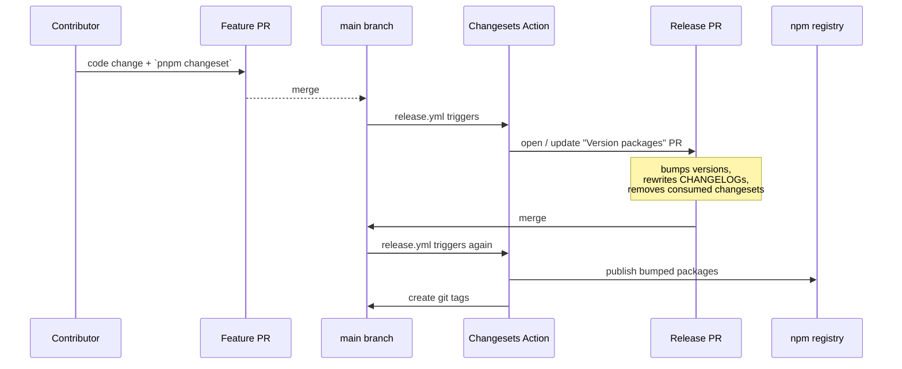

# Releasing public packages

Cloud Infra Blueprint publishes five packages to npm:

| Package                     | Description                                          |
| --------------------------- | ---------------------------------------------------- |
| [`@blueprint/ir`][1]        | Canonical Intermediate Representation                |
| [`@blueprint/hcl`][2]       | HCL parser + emitter (WASM, Web Worker, incremental) |
| [`@blueprint/resources`][3] | AWS / Azure / GCP declarative resource catalog       |
| [`@blueprint/templates`][4] | Pre-baked architecture patterns                      |
| [`@blueprint/ui`][5]        | Design-system primitives on Tailwind + shadcn        |

[1]: https://www.npmjs.com/package/@blueprint/ir
[2]: https://www.npmjs.com/package/@blueprint/hcl
[3]: https://www.npmjs.com/package/@blueprint/resources
[4]: https://www.npmjs.com/package/@blueprint/templates
[5]: https://www.npmjs.com/package/@blueprint/ui

The applications (`@blueprint/web`, `@blueprint/api`, `@blueprint/storybook`) are
not published — they stay private to the monorepo and ship via their own deploy
workflows.

## How releases work

We use [Changesets](https://github.com/changesets/changesets). The flow is fully
automated by the [`release.yml`](../.github/workflows/release.yml) workflow:



## What contributors do

For any PR that changes the **public behavior** of a package above:

```bash
pnpm changeset
```

Pick the affected packages, choose `patch` / `minor` / `major`, and write a
short changelog line. Commit the generated `.changeset/<slug>.md` together
with your code. CI's `changeset-check` job blocks PRs that touch a public
package without one.

For docs-only or app-only changes, no changeset is needed.

See [`.changeset/README.md`](../.changeset/README.md) for details.

## What maintainers do

Nothing manual on a normal release:

1. PRs land on `main` with their changesets.
2. The `release.yml` workflow opens (or updates) a single
   `chore(release): version packages` PR consolidating every pending
   changeset.
3. Reviewing that PR is the only manual step — confirm the version bumps
   and the rendered `CHANGELOG.md` per package look right.
4. Merging it triggers `release.yml` again, which publishes to npm and
   tags the commit.

## One-time setup

The workflow requires a single secret in the repo:

| Name        | Value                                                                                                    | Where                          |
| ----------- | -------------------------------------------------------------------------------------------------------- | ------------------------------ |
| `NPM_TOKEN` | An [npm access token][token] with **Automation** scope and `publish` permission for the `@blueprint` org | `Settings → Secrets → Actions` |

[token]: https://docs.npmjs.com/creating-and-viewing-access-tokens

The first publish requires the `@blueprint` org to exist on npm and the token
owner to be a member with `Developer` role or higher. Subsequent publishes
need no manual steps.

## Manual publish (escape hatch)

In the rare case the action is unavailable:

```bash
pnpm install
pnpm build
pnpm test
pnpm changeset version    # consume pending changesets
git add . && git commit -m "chore(release): version packages"
NODE_AUTH_TOKEN=<your-token> pnpm release
git push --follow-tags
```

This mirrors what the workflow does. Prefer the workflow whenever possible — it
keeps the audit trail clean.
